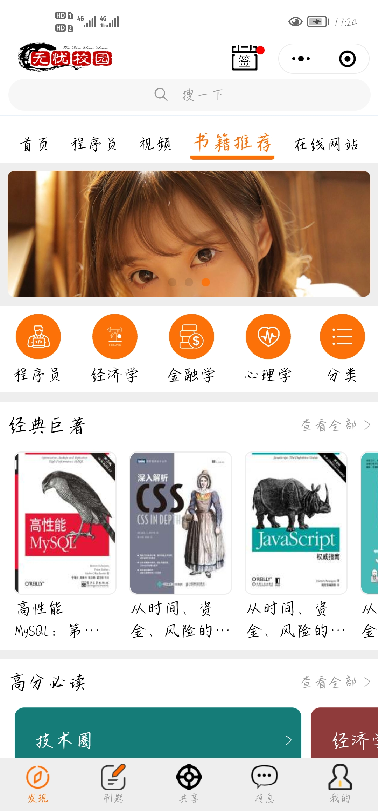
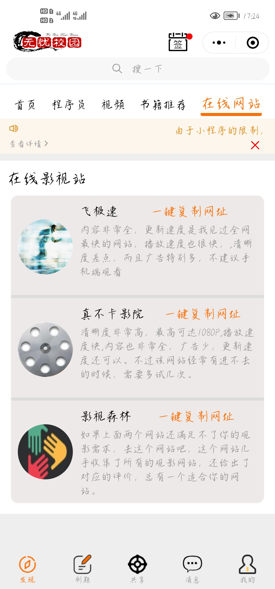
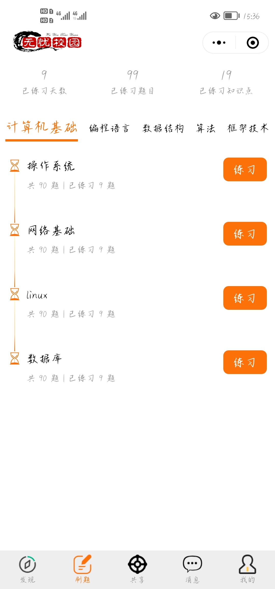
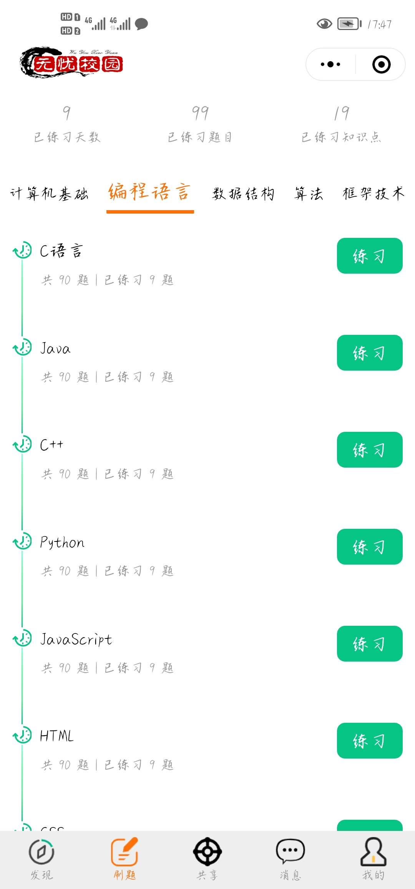
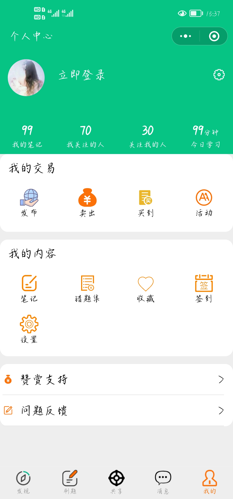

# no_worries_school
关于我的毕业设计---基于微信小程序开发·无忧校园的设计与实现

> 简介   

 	这个项目算是我自学前端以来个人做的最大的项目一个项目了，既是为了完成毕业任务，也是想全面的提升自己，看看学习前端快一年的我到底学到了什么程度。本项目先从大的层面来说，包括的功能模块有阅读文章，视频播放、答题，购买闲置物品(由于是提供在校园内的大学生使用的，所以暂不开发在线支付功能，学生看中物品后可与卖家协商面对面支付，这样还能保证买家买到的商品是可以用的)，并且还能发布自己的闲置物品让其他的买家看到。除了购买和发布闲置物品，还可以参与各种大学生活动和发布自己的活动(聚餐，聚会，一起约玩剧本杀等等大学生想到的活动)功能。除此之外还有聊天功能，这主要是为了辅助购买闲置物品和发布活动用的，方便与用户与用户交流。最后就是用户个人中心了，在这里要管理用户的各项数据，个人感觉会是最难的一部分。
 	综上所述，本人感觉这个项目会很大，以至于从3月初到现在该项目进度还在实现前端界面和功能中，后台还没有搭建起来，不过也快了，前端模块已经完成了快85%了。今天把这个项目上传到这里，一方面是为了尽快找到工作，让各位Boss能够了解我的能力，毕竟都已经到了4月份了，心理实在很慌。另外一方面也想和各位大牛多交流交流，多了解了解我这个项目里有些功能还有哪些更好的优化办法。另外还能锻炼下自己总结的能力，在这里我会定期的推出项目的进度情况，争取每天晚上干完后都来总结一下，像记笔记一样。

> 详细功能模块

介绍前先在在这里贴出该项目的一些前端界面图片，各位大佬或Boss有什么好建议或者想体验手机端的可以联系我(本人邮箱:1096130354@qq.com.微信号:TSMX0315)，因为还没有发布上线，只能先加入管理员才能预览(这是我了解到的情况并拿身边的朋友测试过了)，另外图中内容仅供预览，不是真数据，若有侵权，那对不起，千万别让我赔钱，本人还是学生，赔不起。请及时联系我，我撤掉！
### 发现页面
发现页面的功能模块有：顶部导航栏有签到功能，点击后可进入签到页面签到得积分。然后下面是搜索框，点击后进入搜索页面输入文字进行搜索，目前没有搭建起后台，所以真正的搜索功能还实现不了。再下来就是滚动标签栏，用户可点击也可滑动到自己看的内容。

其中首页大致的结构是轮播图(点击后可进入对应的内容，可以是文章或视频或者其他内容)+内容分类模块(大致分类内容如图所示，后期也可能修改)+每日必看模块(是一个横向滚动的内容形式，点击后可以看到对应的视频内容)+每日必阅模块(和每日必看模块的表现形式一样，点击后可以阅读对应的文章)+发现新知识模块(是一个文章列表的表现形式，包括相关图片，文章标题等等内容)。
 

标签栏第二个程序员模块是一个供程序员学习的平台，界面展现形式如图。以后将为用户提供查看学习路线，学习资源，工具，求职和软技能的文章内容，虽然暂时还没有足够的才华生产这些知识，但本人作为一个程序员，做一个知识的搬运工的能力还是有的。当然为了避免侵权，会在文章开头或者文末说明文章来源，并附上原作者的名字和其公众号地址或者网址。
![程序员模块]InterfacePreview/discover/programmer.jpg)

标签栏第三个视频模块是一个提供看视频的功能，界面借鉴b站APP的界面样式。界面展现形式如图。。视频内容主要以学习为主，视频来源于各个平台的视频，同样为了避免侵权，会说明每个视频来自于哪个平台，哪个作者，并附上原视频地址。

书籍推荐模块是向用户推荐各个行业(包括程序员，经济学，金融学，心理学等等)的一些经典好书，界面展现形式如图。用户点击对应的书籍后即可进入对应的书籍详情描述(包括简介，专家推荐序，书中经典语录)页面，在这里用户可以实现收藏和分享功能，还会附上纸质书购买地址和电子书阅读地址。

最后一个在线网站模块是为用户提供各种非常好用的在线网站资源(内容包括在线影视站，学习，刷题，求职，程序员在线工具等等内容，后期会不断添加，内容会尽量做的全面)，界面展现形式如图。用户点击对应的网站卡片后会复制对应的网址。然后去本地浏览器粘贴打开。

### 刷题页面

刷题功能暂时只支持刷选择题，答题的知识内容有计算机基础，编程语言，数据结构，算法和框架技术。界面展现形式如图。用户点击练习后即可进入答题页面，抽取的题目是从数据库库对应的知识模块里随机抽取的10道选择题，如果是有代码分析的题目，会像markdown一样解析，然后展示代码块。用户答完题目后点击提交即可查看结果。之后用户可选择查看解析或者继续练习。在这里还要记录用户的答错的题目，添加到用户的错题集表里去，方便用户复习。

### 共享页面

共享页面又分为两大模块：闲鱼市场和AA聚会活动模块。

在闲鱼市场模块用户可以查看已经发布过的二手物品，看中后可以与对应的卖家沟通协商什么价格或者可以拿什么东西换。还可以发布自己的闲置物品卖出去。

AA聚会活动模块用户可以查看别人发布的活动(活动内容可以是一起吃饭，玩耍，拼车，聚会，剧本杀，游戏等等大学生想到的活动都可以)，在这里会展示相关的活动信息(包括活动名称，活动地点，活动时间，活动人数，主办方希望能够参加的人数和其联系方式等等其他信息)，用户可以选择自己想参加的活动，然后与主办方联系。另外还要每个活动的活动状态(是否进行中，是否一开始，还需要几人，是否已结束)，主办方也可以自己选择结束活动。另外平台会记录每个参与活动的用户诚信分(最开始是100分)，用户每次如约参加一次活动，会为其加上10分，反之会扣10分，主办方可以看到每个参加他活动的人的诚信分来选择是否要他参加。用户还可以选择发布自己的活动，让别人来参加。界面如图所示，暂时是这样子，后期可能会作修改。请原谅我暂时用美女图片展示，哈哈哈哈哈！

### 消息页面

消息页面是主要是为了辅助购买闲置物品和参加相关活动用的，方便买家与卖家，主办方和参加方进行交流。

### 个人中心页面

最后就是用户个人中心了，在这里要管理用户在该平台留下的各项数据，界面如图所示，其中一些数据后期可能会作修改更新。

